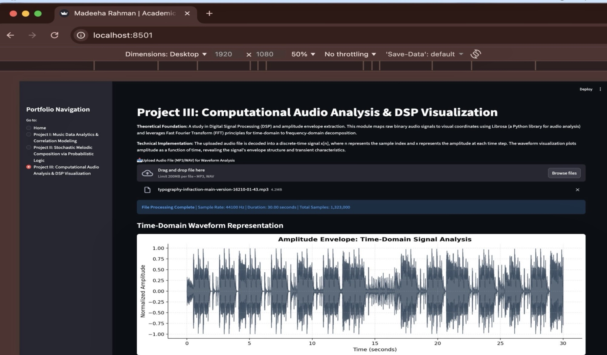
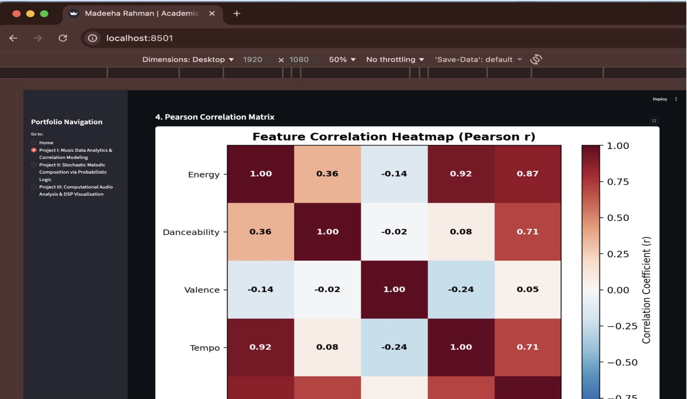
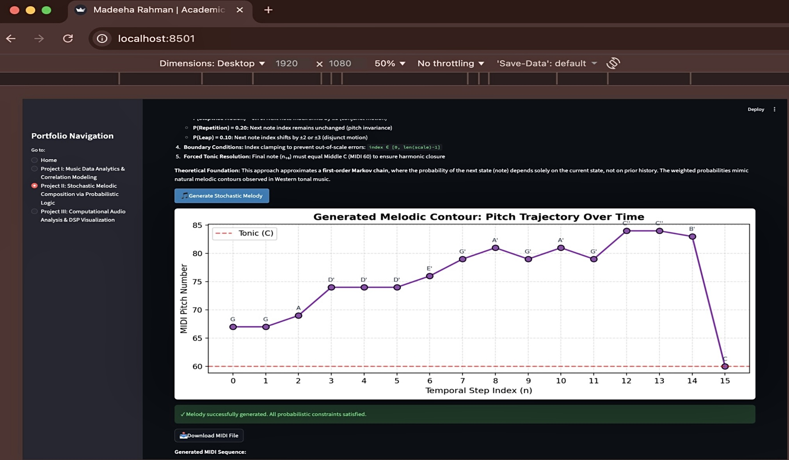

# The Stochastic Architect

The Stochastic Architect is a collection of computational experiments exploring how mathematical structures and algorithms can interact with music. 

Through these projects, I experimented with data analysis, generative systems, and audio visualization to better understand how patterns in music can be modeled and recreated using code.

## Projects

### AI Music Visualizer
Transforms audio signals into dynamic visual representations using frequency and beat analysis.


### Music Data Dashboard
Analyzes musical datasets and visualizes patterns using Python-based data analysis tools.


### Algorithmic Melody Generator
Generates melodies algorithmically using mathematical patterns and rule-based systems.


## Technologies Used
* **Python**
* **NumPy**
* **Pandas**
* **Matplotlib**
* **Librosa**

## Running the Project
```bash
pip install -r requirements.txt
streamlit run app.py
```

## Author

**Madeeha Rahman (Nari)**  
*National Mathematical Olympiad Finalist*

